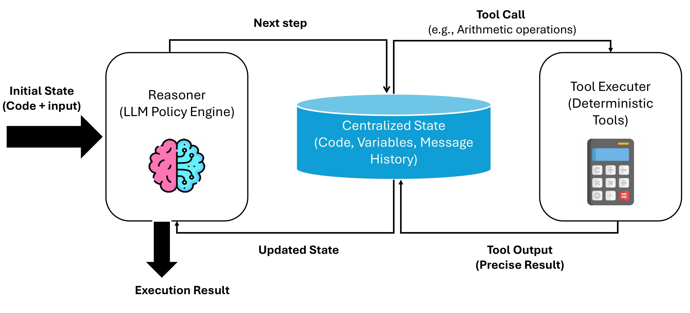

# Tool-Augmented Reasoning Agent

This project implements an AI agent capable of reasoning about code execution step-by-step. It uses **LangGraph** to manage the execution state and is equipped with a **Calculator** tool that it *must* use for any arithmetic operation. This demonstrates a "human-in-the-loop" style reasoning process where the "human" is the LLM reasoning about variables and the "computer" is the tool handling precise calculations.



## Features

- **Step-by-Step Reasoning**: The agent traces the execution of Python code line-by-line.
- **Tool Enforcement**: All arithmetic operations (`+`, `-`, `*`, `/`, `**`) are offloaded to a calculator tool to ensure precision.
- **State Management**: Uses `LangGraph` to maintain the state of variables, current code execution, and conversation history.
- **LangChain Integration**: Built on `LangChain` and `LangGraph` for robust agent orchestration.

## Prerequisites

- Python 3.9+
- OpenAI API Key (GPT-4 recommended for best reasoning performance)

## Installation

1.  **Clone the repository**:
    ```bash
    git clone <repository-url>
    cd tool-augmented-reasoning
    ```

2.  **Create and activate a virtual environment** (optional but recommended):
    ```bash
    python -m venv venv
    # Windows
    .\venv\Scripts\activate
    # Linux/Mac
    source venv/bin/activate
    ```

3.  **Install dependencies**:
    ```bash
    pip install -r requirements.txt
    ```

## Configuration

1.  Copy the example environment file:
    ```bash
    cp .env.example .env
    ```

2.  Open `.env` and add your OpenAI API key:
    ```env
    OPENAI_API_KEY=sk-your_api_key_here
    ```

## Usage

To run the agent with the default sample code (compound interest calculation):

```bash
python main.py
```

### Sample Output

```
--- Starting Agent Execution ---
Code:
--- Starting Agent Execution ---
Code:
def has_close_elements(numbers: List[float], threshold: float) -> bool:

    sorted_numbers = sorted(numbers)
    for i in range(len(sorted_numbers) - 1):
        if sorted_numbers[i + 1] - sorted_numbers[i] < threshold:
            return True
    return False

print(has_close_elements([1.0, 2.0, 3.9, 4.0, 5.0, 2.2],0.3))

--- Execution Trace ---
[Agent]:
  [Tool Calls]: [{'name': 'calculator', 'args': {'a': 2.0, 'b': 1.0, 'operation': '-'}, 'id': 'call_l4xHEvV653a9D1ea38lezbmZ', 'type': 'tool_call'}]
[Tool Output]: 1.0
[Agent]:
  [Tool Calls]: [{'name': 'calculator', 'args': {'a': 2.2, 'b': 2.0, 'operation': '-'}, 'id': 'call_fZdS6PSqG0W7kSSpVg86OHhu', 'type': 'tool_call'}]
[Tool Output]: 0.20000000000000018
[Agent]:
  [Tool Calls]: [{'name': 'calculator', 'args': {'a': 2.0, 'b': 1.0, 'operation': '-'}, 'id': 'call_DM7MwPbeqBsP7lxohtdkAiMk', 'type': 'tool_call'}]
[Tool Output]: 1.0
[Agent]: Step-by-step execution:

...

Final_Result = True
```

## Project Structure

- `src/agent.py`: Defines the LangGraph workflow and the reasoning node.
- `src/tools.py`: Contains the `calculator` tool definition.
- `src/state.py`: Defines the `AgentState` TypedDict.
- `main.py`: Entry point to run the agent.
- `requirements.txt`: Python dependencies.


